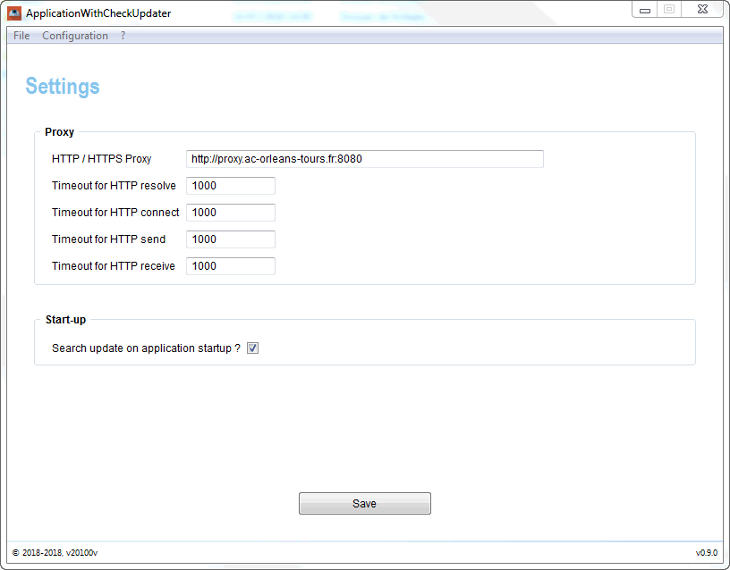
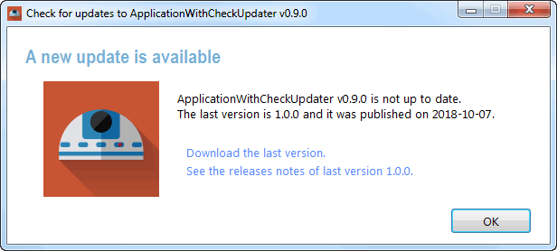
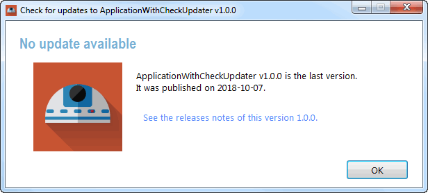
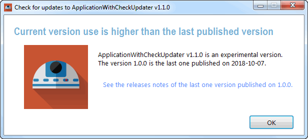

ApplicationWithCheckForUpdates
===========================

> Example to implementation of AGS-component-check-for-updates in AutoIt application.


<br/>

## Features 

 - Check update on startup AutoIt application ;
 - Check update from the menu *"? > Check for update"* ;
 - Change settings application from the view *"Configuration > Settings"*. Values are persisted into the configuration file `./config/parameters.ini`. In this view, we can set proxy parameters to specify how this application try to connect to internet.
 


<br/> 

## Install dependencies

We assume that you have already install [Node.js](https://nodejs.org/) and [Yarn](https://yarnpkg.com/lang/en/), for example with [Chocolatey](https://chocolatey.org/). We recommend you to install it with Yarn, instead of npm. To do this, just type in the root folder of your project where the `package.json` is saved :

```
λ  yarn install
```

All dependencies of this project are installed into the `./vendor` directory. 


<br/>

## Configure AGS project

### Create configuration file `./config/parameters.ini`

You must create the configuration file of this project. It saved into `./config/parameters.ini`. Indeed this file is not save with control version. You can use `./config/parameters.ini.dist` as a "template" of what your `parameters.ini` file should look like. Set parameters here that may be different on each application. Only this file is save with control version and push on remote server.

For example you can choose if the application have to search a new update on start-up with the `LAUNCH_CHECK_FOR_UPDATE_ON_STARTUP` option.

```ini
[AGS_CHECK_FOR_UPDATES]
; [REQUIRED] Enable/disable the search of a new update on start-up.
LAUNCH_CHECK_FOR_UPDATE_ON_STARTUP=1
```

In this configuration file, you can also set proxy settings in order to specify how AutoIt application can connect on Internet to make HTTP request. In this project, we need Internet to check the repository `RELEASE.json` persist on a remote server. This file is used on process to check if a new update is available, by comparing a local version (set in GLOBALS.au3) to a remote version store in this `RELEASES.json` file.

```ini
[AGS_HTTP_REQUEST]
; [OPTIONAL] Use a proxy for http connexion or choose NONE to disable it
# PROXY=NONE
PROXY=http://proxy.ac-orleans-tours.fr:8080
````


### Check constants and variables in `./src/GLOBALS.au3`

All constants and global variables are set in one place `./src/GLOBALS.au3`, with the exception to global variables of graphic elements which are set in each specific view file. Don't forget that constants can't longer change their value over time, unlike global variables. By convention, all global variables must be written in capital letter and separated by underscore - for example : Global Const $APP_EMAIL_CONTACT

For this example project, we set the constant `$APP_REMOTE_RELEASES_JSON` to specifiy the repository JSON use to check for updates. This json file must persist in a remote server available via internet, and without restriction. In this example we use Github to host this file, like this:

```
Global Const $APP_REMOTE_RELEASES_JSON = "https://raw.githubusercontent.com/autoit-gui-skeleton/AGS-component-check-for-updates/master/example/ApplicationWithCheckForUpdates/RELEASES.json"
```

### Change settings in view application

You can change settings application from the view *"Configuration > Settings"*. Values are persisted into the configuration file `./config/parameters.ini`. In this view, we can set proxy parameters to specify how this application try to connect to internet.



To persit values when the user click on save button, we use the service `./src/services/ParametersIni.au3`, which call `IniWrite` method on configuration file `./config/parameters.ini`. Be warning you must create this configuration file before using this application, if you clone this project. 


<br/>

## How to test differents case with the check-updater.

In the remote `RELEASES.json` use in this example, we set two releases like this:

```json
{
  "name": "ApplicationWithCheckForUpdates",
  "description": "Example to implementation of AGS-component-check-for-updates",
  "license": "MIT",
  "homepage": "https://autoit-gui-skeleton.github.io",
  "releases": [
    {
      "version": "1.0.0",
      "state": "stable",
      "downloadSetup": "https://myApplication.com/v1.0.0/setup_myApplication_v1.0.0.exe",
      "published": "2018-10-07",
      "releaseNotes": "https://myApplication.com/v1.0.0/README.md"
    },
    {
      "version": "0.1.0",
      "state": "prototype",
      "downloadSetup": "undefined",
      "published": "2014-03-21",
      "releaseNotes": "undefined"
    }
  ]
}
```

If you want to simulate different scenarios on check updater, you just need to change the value of the application version set in `./src/GLOBALS.au3`. For example to simulate the case of:

 - new version available set it to : `Global Const $APP_VERSION = "0.9.0"` <br/><br/>
 
 - application have not update available : `Global Const $APP_VERSION = "1.0.0"` <br/><br/> 
 
 - application is experimental: `Global Const $APP_VERSION = "1.1.0"` <br/><br/>
 


<br/>

## About

### Release history

 - ApplicationWithCheckForUpdates v1.0.0 - 2018.xx.xx
 - ApplicationWithCheckForUpdates v0.9.0 - 2018.xx.xx
 - ApplicationWithCheckForUpdates v0.1.0 - 2018.xx.xx

### Credits

ApplicationWithCheckForUpdates make use of the folowing AutoIt libbrary:

- [AGS](https://v20100v.github.io/autoit-gui-skeleton/) :: provide an architecture and an organization to efficiently build an desktop application Windows with AutoIt.
- [JSON](https://www.autoitscript.com/forum/topic/148114-a-non-strict-json-udf-jsmn/) :: support JSON which implements jsmn parser.
- ... *mentions in this list all vendors project use in your project* ... 
                                                                                           
### Contributing
 
Comments, pull-request & stars are always welcome !
 
### License
 
Copyright (c) 2018 by [v20100v](https://github.com/v20100v). Released under the MIT license.